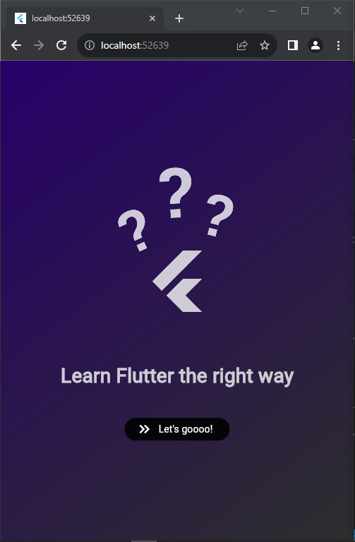
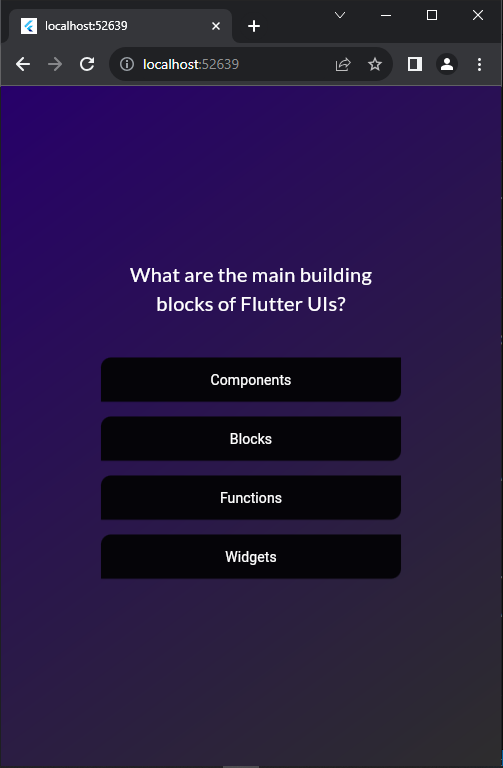
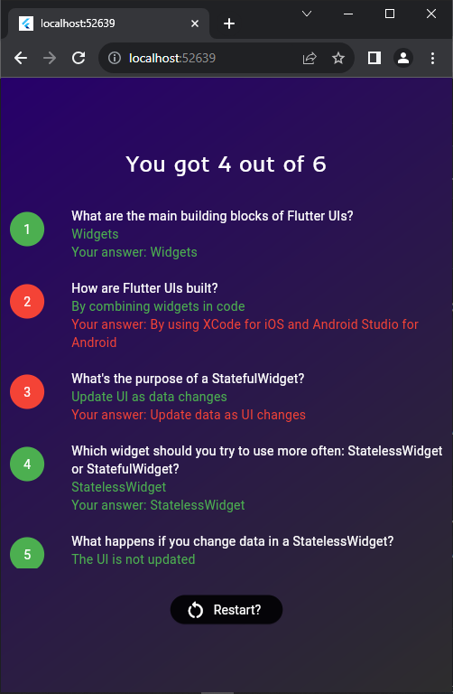

# Flutter Quiz App

A simple quiz app built using Flutter that allows users to take a quiz consisting of 6 questions on Flutter basics. The app includes a splash screen, individual screens for each question, and a final screen displaying the quiz result. Users can restart the quiz from the result screen.

## Features

- **Splash Screen**: Upon launching the app, users are greeted with a splash screen.
- **Quiz Questions**: The app presents users with 5 questions, each on a separate screen.
- **Result Screen**: After answering all questions, users are shown their quiz result on a final screen.
- **Restart Quiz**: Users can restart the quiz from the result screen.

## Screenshots


*Splash Screen*


*Question Screen*


*Result Screen*

## Installation

1. Clone the repository:

```
git clone https://github.com/adebola-duf/quiz_app.git
```

2. Navigate to the project directory:
```
cd quiz_app
```


3. Run the app:
```
flutter run
```

## Usage

1. Launch the app on your device or emulator.
2. On the splash screen, tap the "Start Quiz" button to begin.
3. Answer each question presented on different screens.
4. After answering all questions, view your result on the final screen.
5. To restart the quiz, tap the "Restart Quiz" button on the result screen.

## Dependencies

This project uses the following dependencies:

- `flutter/material.dart`: Flutter framework for building the UI.
- `google_fonts/google_fonts.dart`: Package for google fonts.

## Contributing

Contributions are welcome! If you have any suggestions, bug fixes, or improvements, feel free to open an issue or create a pull request.

